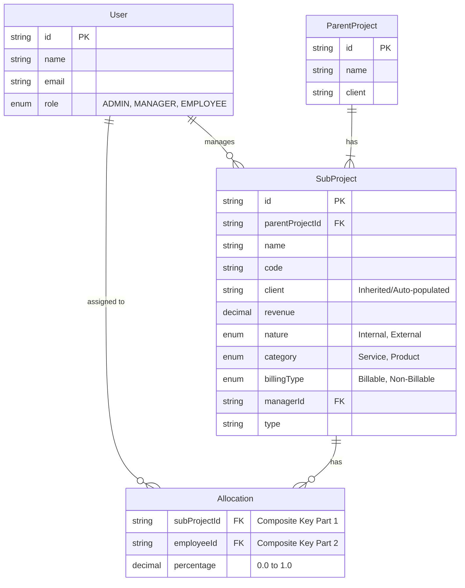

# Project Module Backend Specification

## Overview

This document outlines the functional and technical requirements for the **Project Management Module**. It is intended for the backend engineering team (Spring Boot) to implement the necessary APIs, data models, and business logic.

## 1. Data Entities & Relationships

### 1.1 Entity Relationship Diagram (Conceptual)



## 2. API Specifications & Data Contracts

### 2.1 Parent Project

#### Create Parent Project

- **Endpoint:** `POST /api/projects/parents`
- **Description:** Creates a new parent container for sub-projects.
- **Request Body:**
  ```json
  {
    "name": "Acme Corp Digital Transformation",
    "client": "Acme Corp"
  }
  ```
- **Validation:**
  - `name`: Mandtory, Non-empty.
  - `client`: Mandatory, Non-empty.

#### Get Parent Projects

- **Endpoint:** `GET /api/projects/parents`
- **Response:** List of Parent Projects.

### 2.2 Sub Project

#### Create Sub Project

- **Endpoint:** `POST /api/projects/sub`
- **Description:** Creates a specific billable/non-billable project under a parent.
- **Request Body:**
  ```json
  {
    "parentProjectId": "pp_123",
    "projectName": "Phase 1 - Migration",
    "projectCode": "ACME-MIG-001",
    "client": "Acme Corp",
    "managerId": "usr_456",
    "revenue": 50000.0,
    "projectNature": "External",
    "category": "Service",
    "billingType": "Billable",
    "type": "Fixed Bid"
  }
  ```
- **Fields Analysis:**
  - `parentProjectId`: **Mandatory**. Must exist.
  - `managerId`: **Mandatory**. UUID of a user with role `MANAGER` (or ADMIN).
  - `client`: **Mandatory**. Ideally redundant if fetched from Parent, but frontend sends it. Backend should validate it matches Parent OR just ignore and take from Parent. _Recommendation: Backend should populate this from ParentProject to ensure consistency._
  - `revenue`: **Mandatory**. Positive Decimal.
  - `projectNature`: Enum [`Internal`, `External`].
  - `category`: Enum [`Service`, `Product`].
  - `billingType`: Enum [`Billable`, `Non-Billable`].

#### Update Sub Project

- **Endpoint:** `PUT /api/projects/sub/{id}`
- **Description:** Updates details. Note: Changing `parentProjectId` is an edge case (see Section 4).

### 2.3 Resource Allocation

#### Bulk Allocate (Create/Update Project Flow)

- **Endpoint:** `POST /api/allocations/bulk`
- **Description:** Assigns multiple employees to a single project. Used during the Project Wizard (Step 2).
- **Request Body:**
  ```json
  {
    "subProjectId": "sp_789",
    "allocations": [
      { "employeeId": "emp_001", "allocation": 0.5 },
      { "employeeId": "emp_002", "allocation": 1.0 }
    ]
  }
  ```
- **Logic:**
  - If an allocation record exists for (subProject, employee), update it.
  - If it implies removing an employee (0.0 allocation), hard delete or soft delete the record.

#### Update Single Allocation (Matrix View)

- **Endpoint:** `PUT /api/allocations`
- **Description:** Update a specific cell in the allocation matrix.
- **Request Body:**
  ```json
  {
    "subProjectId": "sp_789",
    "employeeId": "emp_001",
    "allocation": 0.8
  }
  ```

#### Get Allocations

- **Endpoint:** `GET /api/allocations`
- **Query Params:**
  - `projectId` (optional)
  - `employeeId` (optional)
- **Response:** List of allocation objects.

## 3. Validation & Business Rules

### 3.1 Mandatory Fields

- **All fields** in the Sub Project creation form are treated as mandatory by the frontend.
- **Backend Rule:** Reject any creation request with null/empty values for: `name`, `code`, `revenue`, `manager`, `type`.

### 3.2 Allocation Rules

- **Range:** Allocation value must be between `0.0` and `1.0` (inclusive).
  - Frontend sends float (e.g., `0.5` for 50%).
  - Backend should allow precision up to 2 decimal places.
- **Total Allocation Warning:**
  - The sum of an employee's allocations across _active_ projects should ideally be `1.0`.
  - **Backend Validation:** Can be a soft warning or hard limit depending on config. _Current Frontend Behavior: Visual warning only (Red icon if != 100%). Backend should accept values > 1.0 but potentially flag them._

### 3.3 Role-Based Access Control (RBAC)

- **ADMIN**:
  - Create/Edit Parent & Sub Projects.
  - Manage Allocations for ALL projects.
  - View ALL projects.
- **MANAGER**:
  - View Sub Projects where `managerId` == `currentUserId`.
  - View Allocations for their projects.
  - (Optionally) Edit Allocations for matches (depending on detailed reqs, currently Frontend assumes read-only or specific edit rights).
- **EMPLOYEE**:
  - View Sub Projects where they have an active Allocation > 0.
  - View their own Allocation row only.

## 4. Edge Cases & Special Scenarios

### 4.1 Parent Project Change

- **Scenario:** User changes the "Parent Project" dropdown in Sub Project Edit mode.
- **Backend Implication:**
  - The `Category`/`Client` might technically change if inherited.
  - Backend must verify if the new Parent Project exists.
  - Frontend currently disables `ParentProject` selection in Edit Mode to avoid this complexity. **Backend should likely block changing `parentProjectId` on update unless specifically required.**

### 4.2 Partial Allocation

- **Scenario:** Admin sends `0.0` or empty value for allocation.
- **Handling:** Treat as removal of allocation (DELETE) for that employee-project pair.

### 4.3 Concurrent Edits

- **Scenario:** Admin A updates revenue while Admin B updates the Manager.
- **Recommendation:** Last Write Wins (LWW) is acceptable for V1. Standard Optimistic Locking (`@Version`) is recommended for critical financial fields like `revenue`.

### 4.4 Search & Filtering

- **Requirement:** The list endpoints (`/projects`, `/sub-projects`) should support filtering.
  - `?search=...` : Fuzzy match on Name, Code, Client.
  - `?managerId=...` : Exact match.
  - `?employeeId=...` : Return projects containing this employee.

## 5. Frontend Assumptions

1.  **Client Name consistency:** Frontend assumes `Client` names are strings and relies on the user/parent-project to keep them consistent. Ideally, `Client` should be a separate entity, but currently, it's a string property on `ParentProject`.
2.  **Date Handling:** No start/end dates are currently tracked in the simple flow.
3.  **Project Code Uniqueness:** Frontend does not enforce global uniqueness check before submit. **Backend MUST enforce `unique` constraint on `SubProject.projectCode`.**

## 6. Error Handling

- **400 Bad Request:** Missing mandatory fields, Invalid allocation range (<0 or >1).
- **409 Conflict:** Duplicate Project Code.
- **404 Not Found:** Manager ID not found, Parent Project ID not found.

---

**Note to Developer:** The frontend uses ephemeral IDs (e.g., `sp1738...`) for new items before persistence. The backend should ignore these inputs on creation and return the authoritative database-generated UUIDs.
